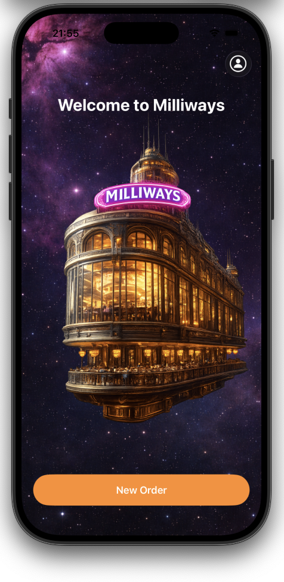

# Milliways Demo App (web)

  

A demo restaurant stack inspired by The Restaurant at the End of the Universe: **web** (Angular under `web/`) and a shared **Node** backend.

## Repository layout

| Path | Contents |
|------|----------|
| `backend/` | Node demo API and Docker image |
| `web/` | **Angular** SPA — menu, cart, checkout, delivery, account |
| `guide/` | QA training guide for TestChimp workflows — start with **`guide/TESTING_GUIDE.md`** |

## Purpose

This is a **web starter app** for learning [TestChimp](https://testchimp.io). Fork it and add your own SmartTests (Playwright), test plans, TrueCoverage instrumentation, and CI workflows from scratch.

The app features a food ordering flow with a space-themed menu, shopping cart, delivery tracking, and user account — providing UI journeys to practice **web** testing.

## Known Issues

This application contains intentionally placed bugs for testing purposes.

## Getting Started

1. Clone the repository
2. Start the demo backend with Docker:
   ```bash
   docker compose up --build -d
   ```
3. **Web:** `cd web && npm install && npm start` → [http://localhost:4200](http://localhost:4200)

The local API is exposed at `http://localhost:3001`. The Angular dev server proxies API calls via `web/proxy.conf.json`.

Optional: `./scripts/qa/local-up.sh` (Docker + health wait).

## Community

Join our [Slack](https://join.slack.com/t/mobile-next/shared_invite/zt-37fdhc001-CjZkz8QIZB8dSi486~F0uA), let's talk.
